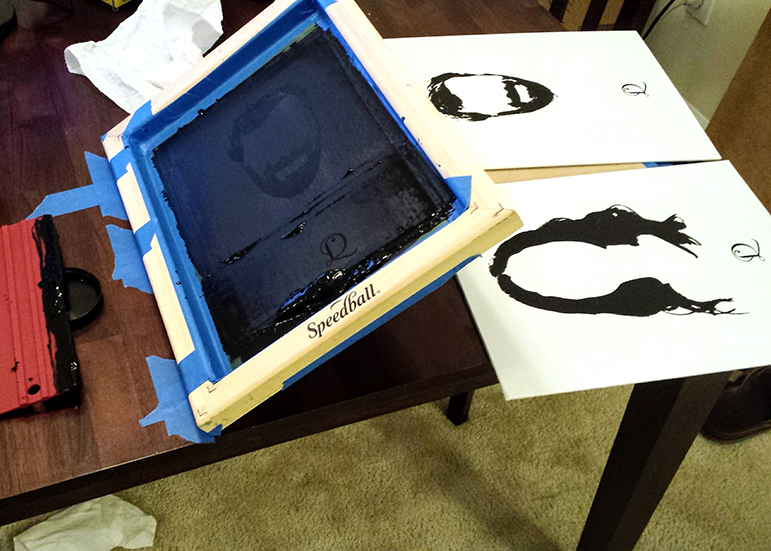
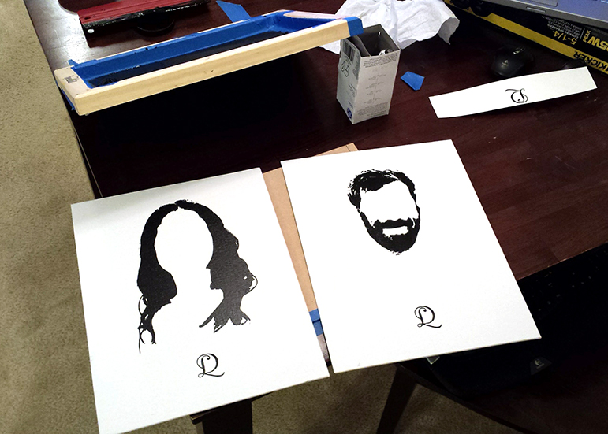
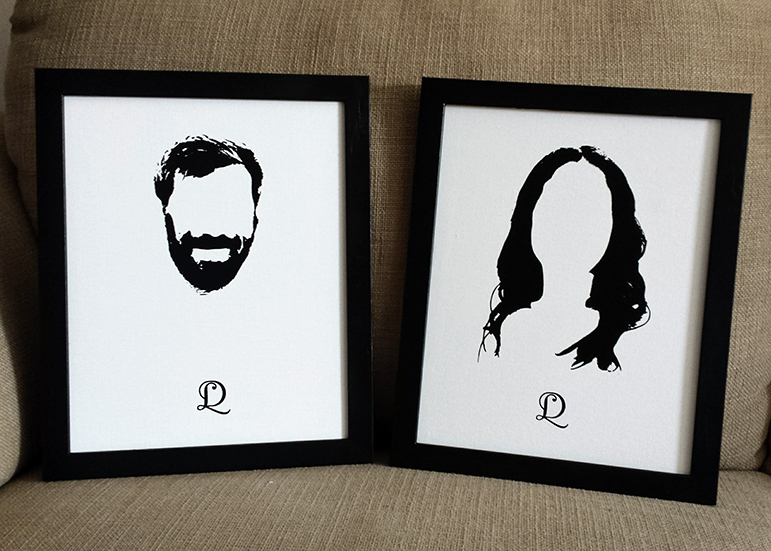

Every now and then I like to take on a project and try something I've never done before. Making things with your hands brings a great sense of satisfaction, getting to touch and see your creation, in a way that code can't. 

I'd been interested in screen printing for a while, and a friend's upcoming wedding provided the perfect source of motivation and a deadline for a project. The concept and design are (as far as I konw) original, and it took quite a while to get that part down. The illustrations were done in Illustrator manually, which was a bit tedious, but provided better results than any automated method I tried.

My printing setup is shown below, and it's certainly not what you would call professional. Creating the screen was surprisingly simple once you have the right materials. I bought one of those beginner screenprinting kits, so it came with everything I needed to create the screen using the photoresist method. The idea is that you coat the screen with a light-sensitive pigment, cover it with a transparency of the design, and shine a light on it for a while. The uncovered pigment reacts with the light and turns hard, while the pigment under the transparency stays un-cured and is easily washed away.

<!--more-->

Once the scareen was prepared I needed to put ink to paper. The process is simply to press the screen against the paper, coat it with ink, and use a squeegee to press the ink through the open sections of the screen and onto the paper. The tricky part was figuring out how to secure the screen such that it would be aligned with the paper and be able to be lifted directly off after printing so as not to slide around and smudge the ink. 

The 'real' way to do this involves mounting the sreen on a hinged arm, but my kitchen-table method was to use tape as a hinge, keeping the screen in place and allowing me to rotate it up and down onto the paper. A little janky, but it was easy to set up and I thought I'd give it a go.

As you can see, the results turned out exceedingly well. This is acutally my second or third print, but I think that's pretty good for my fist time. The little details in they hair came out perfectly and there was no smudging. I finished them in black frames, and the final result is below. Overall I thought the project was a great success, and was really happy with the print quality! 

