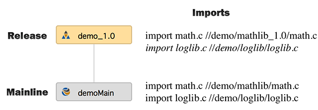

Import inheritance behavior in Perforce between parent and child streams can result in uncontrolled changes to release streams that is impossible to prevent. Specifically, the issue is that any imports that are added to a mainline will be inherited by all of its existing release streams, introducing files that didn't exist when those releases were created. There is currently no way to prevent this behavior with normal stream usage, though I have found a few workarounds.

<!--more-->

Our standard workflow when creating releases is to copy the imports from the mainline upon release creation and ensure that all imports came from release streams. This worked because the release stream (a child of the mainline) would override each mainline import with its own, as shown in the example below.



The trouble comes when a new import source is introduced to the mainline (eg. logLib below). Existing release streams will silently inherit the new import, shown in red, adding new files to the workspace of a release with no indication to you as you modify the mainline that you are also modifying all of your releases. This behavior is certainly unexpected, and completely breaks the notion of a "release" stream that should preserve the source in the released state. I have [asked on the Perforce forums](https://forums.perforce.com/index.php?/topic/5654-release-stream-import-inheritance/) and confirmed that there is no way to prevent this behavior. 

I have always had mixed feelings about imports in perforce streams. On the face of it, I think the concept is very powerful for component-based development, and is one of the main reasons I pushed to move to Streams. Unfortunately, Perforce implements imports in a way that has no revision control, and as I recently found out, doesn't actually work in the mainline branching model that Streams is designed around. 

### Workarounds

There are two potential workarounds for this bug, both targeted at breaking the inheritance link between release streams and the mainline. The first is to create an empty mainline stream that is set as the parent for each release stream. This way there are no imports in the mainline to inherit, since it isn't the real mainline. The second is to change the stream type of each release stream to a mainline, which will prevent it from inheriting anything.

Both of these options break the connection between release streams and the mainline they came from which solves the inheritance problem, but could make things very confusing and unorganized. Moving changes from the release to the mainline would require juggling the release stream parent properties, and generally seems like a pain. Using an empty mainline appears to bet the better of the two since it at least keeps the releases organized together and won't clutter up the stream graph view with a bunch of mainlines, but both feel like dirty hacks that shouldn't be necessary.