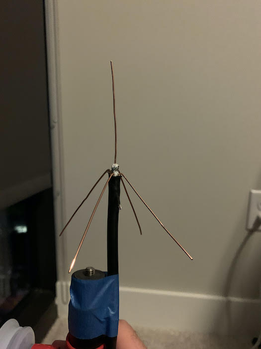

Virtually all aircraft flying in the US are equipped with equipment that continuously transmits their position to air-traffic control and other aircraft. With a Raspberry Pi, a Software-Defined Radio (SDR), and a bit of coaxial cable, you can receive these signals and track aircraft from hundreds of miles away! This post describes my setup that, while put together with parts I had on-hand, achieved impressive results.

<!--more-->

### Components

The three components needed to receive ADS-B signals are an antenna, a radio to convert the analog antenna signals into digital data, and a computer to process that data and decode the ADS-B messages it contains.

My antenna is constructed out of a length of standard coaxial cable, requiring no other parts or soldering, and only took about an hour to construct. I did seal the end of the cable with a dab of hot-glue to prevent water getting inside. See [this post](https://discussions.flightaware.com/t/three-easy-diy-antennas-for-beginners/16348/8) for build instructions. 

The radio I used is the [RTL-SDR Blog](https://smile.amazon.com/RTL-SDR-Blog-RTL2832U-Software-Defined/dp/B0129EBDS2/ref=sr_1_5?crid=3R133HJPA60PY&keywords=rtlsdr+v3&qid=1578875383&sprefix=rtl+sdr+v%2Caps%2C145&sr=8-5) unit. It has a rugged metal enclosure which helps for heat dissipation, and generally seems to have the best performance of the units I've tried. 

Lastly, I used a [Raspberry Pi 3 Model B+](https://www.raspberrypi.org/products/raspberry-pi-3-model-b-plus/) running the [ADS-B Exchange software](https://www.adsbexchange.com/how-to-feed/) to process the data and feed it to ADSB-exchange, in addition to a local monitoring page (the screenshots you see here).

### Setup

At the time I did this work I was living in a high-rise apartment on the 19th floor. I first tried mounting the antenna on the inside of the window, but saw very poor performance with only one or two aircraft being picked up. Without any way of mounting the antenna outside and getting the cable inside, I decided to put the whole system outside on the balcony. 

The biggest concern was water getting where it shouldn't, but with the sealed metal RTL-SDR enclosure and a metal enclosure for the Raspberry Pi, I decided that taping up the connections between the components and taping the openings of the Raspberry Pi case would be sufficient. The balcony had an overhang from the floor above, so the antenna was the only part directly exposed to the rain. With no issues during about a month of operation, I'd say it was successful.

#### Results

The maximum range I saw were targets over 250 miles (400km) away around Nashville (I was in Midtown Atlanta), and typically saw over 100 aircraft detected. ADS-B signals are very directional, so the majority of aircraft picked up were in directions where I had a clear line-of-sight to the horizon - North-West and North-East. Surprisingly I was able to receive aircraft from the Atlanta Airport (even on taxiing the ground) despite the fact that my balcony faced the opposite direction. I believe this was due to reflection of the signals off of the building next to mine. 

Overall, I was very happy with the results, and find it pretty amazing that I was able to receive messages from an aircraft hundreds of miles away with nothing more than a bit of wire and a $20 software-defined radio.