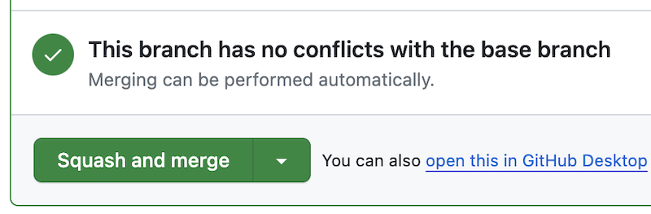
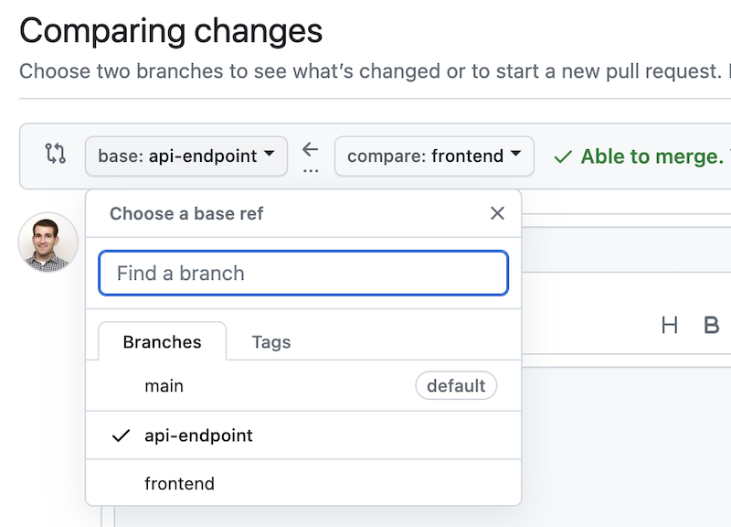
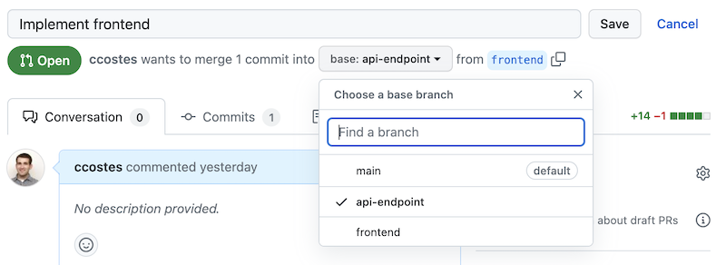
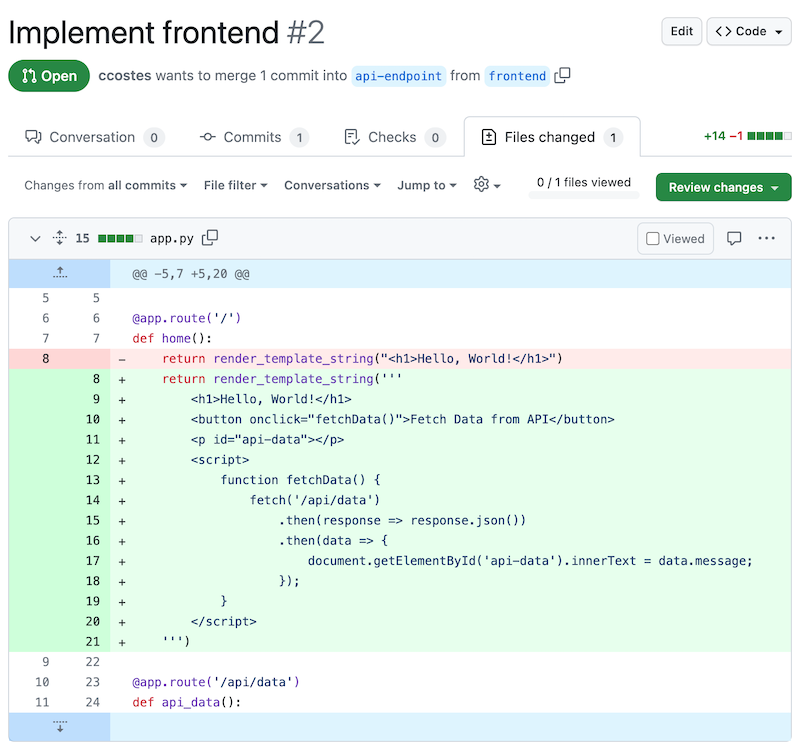

I recently stumbled upon a discussion by [@timoliver](https://www.threads.net/@timoliver) highlighting the advantages of the "stacked diffs" workflow at Instagram over traditional GitHub Pull Requests. I was intrigued, but a bit confused: this method seems an awful lot like a PR-stacking workflow I use from time to time.
<blockquote class="text-post-media" data-text-post-permalink="https://www.threads.net/@timoliver/post/Cyh2ZNprQO2" data-text-post-version="0" id="ig-tp-Cyh2ZNprQO2" style=" background:#FFF; border-width: 1px; border-style: solid; border-color: #00000026; border-radius: 16px; max-width:540px; margin: 1px; min-width:270px; padding:0; width:99.375%; width:-webkit-calc(100% - 2px); width:calc(100% - 2px);"> <a href="https://www.threads.net/@timoliver/post/Cyh2ZNprQO2" style=" background:#FFFFFF; line-height:0; padding:0 0; text-align:center; text-decoration:none; width:100%; font-family: -apple-system, BlinkMacSystemFont, sans-serif;" target="_blank"> <div style=" padding: 40px; display: flex; flex-direction: column; align-items: center;"><div style=" display:block; height:32px; width:32px; padding-bottom:20px;"> <svg aria-label="Threads" height="32px" role="img" viewBox="0 0 192 192" width="32px" xmlns="http://www.w3.org/2000/svg"> <path d="M141.537 88.9883C140.71 88.5919 139.87 88.2104 139.019 87.8451C137.537 60.5382 122.616 44.905 97.5619 44.745C97.4484 44.7443 97.3355 44.7443 97.222 44.7443C82.2364 44.7443 69.7731 51.1409 62.102 62.7807L75.881 72.2328C81.6116 63.5383 90.6052 61.6848 97.2286 61.6848C97.3051 61.6848 97.3819 61.6848 97.4576 61.6855C105.707 61.7381 111.932 64.1366 115.961 68.814C118.893 72.2193 120.854 76.925 121.825 82.8638C114.511 81.6207 106.601 81.2385 98.145 81.7233C74.3247 83.0954 59.0111 96.9879 60.0396 116.292C60.5615 126.084 65.4397 134.508 73.775 140.011C80.8224 144.663 89.899 146.938 99.3323 146.423C111.79 145.74 121.563 140.987 128.381 132.296C133.559 125.696 136.834 117.143 138.28 106.366C144.217 109.949 148.617 114.664 151.047 120.332C155.179 129.967 155.42 145.8 142.501 158.708C131.182 170.016 117.576 174.908 97.0135 175.059C74.2042 174.89 56.9538 167.575 45.7381 153.317C35.2355 139.966 29.8077 120.682 29.6052 96C29.8077 71.3178 35.2355 52.0336 45.7381 38.6827C56.9538 24.4249 74.2039 17.11 97.0132 16.9405C119.988 17.1113 137.539 24.4614 149.184 38.788C154.894 45.8136 159.199 54.6488 162.037 64.9503L178.184 60.6422C174.744 47.9622 169.331 37.0357 161.965 27.974C147.036 9.60668 125.202 0.195148 97.0695 0H96.9569C68.8816 0.19447 47.2921 9.6418 32.7883 28.0793C19.8819 44.4864 13.2244 67.3157 13.0007 95.9325L13 96L13.0007 96.0675C13.2244 124.684 19.8819 147.514 32.7883 163.921C47.2921 182.358 68.8816 191.806 96.9569 192H97.0695C122.03 191.827 139.624 185.292 154.118 170.811C173.081 151.866 172.51 128.119 166.26 113.541C161.776 103.087 153.227 94.5962 141.537 88.9883ZM98.4405 129.507C88.0005 130.095 77.1544 125.409 76.6196 115.372C76.2232 107.93 81.9158 99.626 99.0812 98.6368C101.047 98.5234 102.976 98.468 104.871 98.468C111.106 98.468 116.939 99.0737 122.242 100.233C120.264 124.935 108.662 128.946 98.4405 129.507Z" /></svg></div> <div style=" font-size: 15px; line-height: 21px; color: #999999; font-weight: 400; padding-bottom: 4px; "> Post by @timoliver</div> <div style=" font-size: 15px; line-height: 21px; color: #000000; font-weight: 600; "> View on Threads</div></div></a></blockquote>
<script async src="https://www.threads.net/embed.js" type="text/javascript"></script> 

The tl;dr is that it's a recursive twist on the standard feature-branch workflow. Branching off a feature branch works just as well as branching from `main`, and GitHub PRs handle this nicely. Just like commits enable you to segment changes within a PR, stacking PRs allows you to segment changes within an overall feature into appropriately-scoped reviews.

It seems like this workflow might not be widely known, so per Tim's suggestion I decided to dust off the ol' blog and document how I use it.

<!--more-->

## Standard PR Workflow

Let me start with my usual PR process, which follows the conventional feature-branch workflow: branch from main, develop, push to remote, and then create a GitHub PR.

I'm a big fan of using commits as checkpoints during development, offering the freedom to experiment with the security of a fallback. For larger PRs, commits can also help reviewers by acting as "mini-PRs", breaking the overall change down into smaller logical chunks which can be reviewed separately.

In case of conflicts: fetch, rebase on `origin/main`, and force-push. (A quick shoutout to IntelliJ's automatic conflict resolution tool—it's a lifesaver for rebases!)

After review and approval, squash and merge the changes into `main` as a single commit.

## PR Stacking

A potential issue of the above workflow is having to wait for the PR's review and merge into `main` before you can continue development on the changes. PR stacking neatly sidesteps this by branching your next feature branch from the one currently under review, instead of main. Essentially, you're treating the parent feature branch as your new `main`. This recursive approach can be repeated as needed, although I generally don't exceed one or two levels.

When creating the child PR on GitHub, just set the base to the parent branch (not `main`) to avoid mingling changes from the parent. Once the parent PR merges, GitHub automatically updates the child PR’s base to `main` (or whatever the parent's base was), facilitating a smooth, sequential merging of the stacked PRs.



Here's a quick demonstration using a basic python web app. The overall feature requires a new API endpoint as well as frontend changes, which we will separate into two PRs.

## Example
### Starting Point
We begin on our `main` branch with a simple `app.py` file.
```python
app = Flask(__name__) 

@app.route('/') 
def home(): 
	return render_template_string("<h1>Hello, World!</h1>")
```

### API Endpoint PR
Next we implement the new API endpoint, creating a `api-endpoint` branch off of `main` and making a commit with the new route.
```python
@app.route('/api/data') 
def api_data(): 
	return jsonify({"message": "Hello from API"})
```
Create a PR on GitHub for the `api-endpoint` branch as normal to start the review process.

### Stacked Frontend PR

Without waiting for the API PR review, we create a `frontend` branch from `api-endpoint`. This includes the new API code, which we then utilize in the `home` page. After committing, create a PR as usual, but set `api-endpoint` as the base, not `main`.


This results in a PR which only includes our frontend changes.



### Review and Merge

We now have two independent PRs for review. Post-approval of the API PR, squash and merge it. GitHub will update the Frontend PR's base to `main`. After approval, merge the Frontend PR normally. 



## Drawbacks

One challenge with PR stacking is rebasing updates from master into child branches. This process mirrors the standard feature-branch workflow, just repeated for every branch starting from the topmost feature branch and repeating for each child. This can become cumbersome with too many child-branches, hence my preference to limit the stacking depth.

## Stacked Diffs

I'm interested to learn more about the "stacked diffs" workflow, and tools like [Graphite](https://graphite.dev/) mentioned in the original discussion. It seems similar to the approach described above, but with a PR for each commit.

While smaller PRs quicken review times, you're also multiplying the number of reviews while also dilute context of the overall change into separate PRs. I worry that this might lead to surface-level feedback and make it harder to review larger design choices that span across commits and might be hard to see by looking at them individually.

That said, it's always hard to judge tools or processes without first-hand experience, so I'd love to hear from anyone who's used this workflow in practice!
