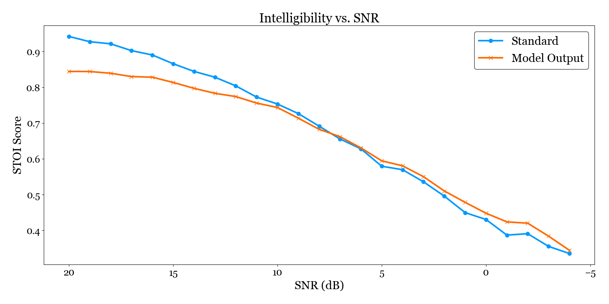
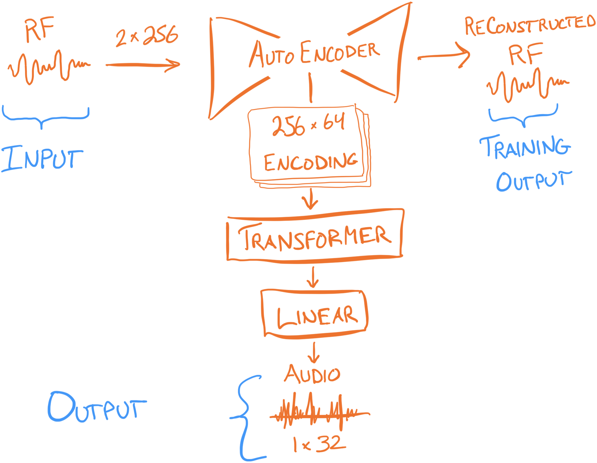
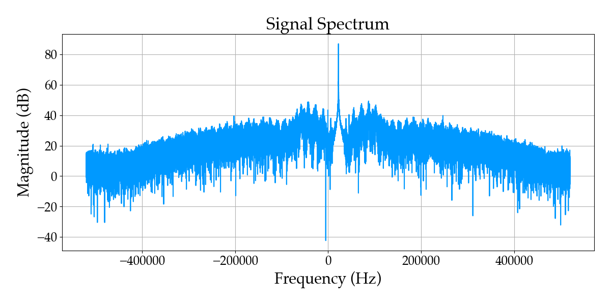
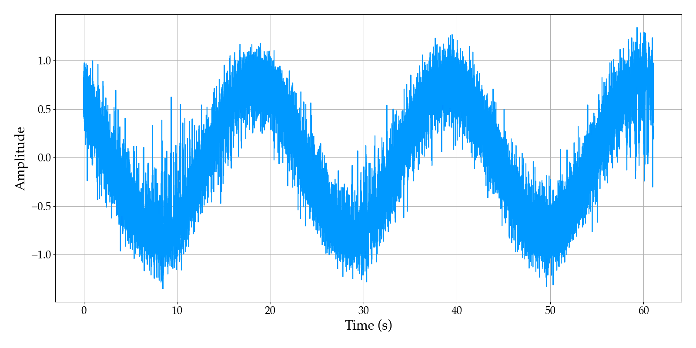

> *I wonder if a neural network could receive radio signals?*

That was the thought that led to this project. Whether you could train a model, with just radio signals and their corresponding audio, to do that conversion without knowing anything about the signals themselves.

Spoiler alert: it is possible! Not only that, the network can reduce noise and enhance the audio at the same time! Here is a comparison of the model output vs. traditional demodulation on a noisy signal:

**Standard Processing:**
<audio controls src="0dB_standard.wav"></audio>
**Model Output:**
<audio controls src="0dB_model.wav"></audio>

Pretty impressive, right? Subjectively I think the model output is noticeably clearer, and this is backed up by an [objective measure](https://github.com/mpariente/pystoi) of speech intelligibility, showing the model consistently outperforming as noise increases (left-to-right on the chart).

The context for this project was that I had been studying neural nets, especially Andrej Karpathy's excellent [YouTube series](https://www.youtube.com/watch?v=VMj-3S1tku0&list=PLAqhIrjkxbuWI23v9cThsA9GvCAUhRvKZ&pp=iAQB), and wanted to try applying that knowledge to a "real" problem. This is a sort of after-action report on the main challenges and learnings. You can find the code for the project on [GitHub](https://github.com/ccostes/ml).

While not strictly necessary, a basic understanding of software-defined radio (SDR) and amplitude modulation would help to follow along, which I cover in my previous article [AM Demodulation Illustrated](/posts/ml/am_explainer) with visualizations and code.

## Goals
The goal of this project was to get experience applying Machine Learning to a "real" problem, going through the entire process from problem analysis through to implementation, evaluation, and iteration. While I obviously hoped to get a working result, the goal was not to build a better radio.

## Problem
I chose "Receiving AM Radio" as the problem for a few reasons; mainly that it seemed cool. I did have some background knowledge (having written an [SDR library](https://github.com/ccostes/rtl-sdr-rs), and done a few SDR projects previously) that would hopefully allow me to focus more of my attention on the ML aspects. The radio aspects ended up being a challenge in their own right as you'll see, so this foundation was definitely a factor in success.

The basic idea was to replace the traditional demodulation process with a neural network, taking in RF signal from the SDR, and outputting audio.

## Feasibility Study
I started experimenting, trying basic model architectures with synthetic data, to try to get a sense of whether this was going to work at all. It did not go well:
<blockquote class="text-post-media" data-text-post-permalink="https://www.threads.net/@ccostes3/post/C3bbjL_tLiD" data-text-post-version="0" id="ig-tp-C3bbjL_tLiD" style=" background:#FFF; border-width: 1px; border-style: solid; border-color: #00000026; border-radius: 16px; max-width:540px; margin: auto; min-width:270px; padding:0; width:99.375%; width:-webkit-calc(100% - 2px); width:calc(100% - 2px);"> <a href="https://www.threads.net/@ccostes3/post/C3bbjL_tLiD" style=" background:#FFFFFF; line-height:0; padding:0 0; text-align:center; text-decoration:none; width:100%; font-family: -apple-system, BlinkMacSystemFont, sans-serif;" target="_blank"> 

 <svg aria-label="Threads" height="32px" role="img" viewBox="0 0 192 192" width="32px" xmlns="http://www.w3.org/2000/svg"> <path d="M141.537 88.9883C140.71 88.5919 139.87 88.2104 139.019 87.8451C137.537 60.5382 122.616 44.905 97.5619 44.745C97.4484 44.7443 97.3355 44.7443 97.222 44.7443C82.2364 44.7443 69.7731 51.1409 62.102 62.7807L75.881 72.2328C81.6116 63.5383 90.6052 61.6848 97.2286 61.6848C97.3051 61.6848 97.3819 61.6848 97.4576 61.6855C105.707 61.7381 111.932 64.1366 115.961 68.814C118.893 72.2193 120.854 76.925 121.825 82.8638C114.511 81.6207 106.601 81.2385 98.145 81.7233C74.3247 83.0954 59.0111 96.9879 60.0396 116.292C60.5615 126.084 65.4397 134.508 73.775 140.011C80.8224 144.663 89.899 146.938 99.3323 146.423C111.79 145.74 121.563 140.987 128.381 132.296C133.559 125.696 136.834 117.143 138.28 106.366C144.217 109.949 148.617 114.664 151.047 120.332C155.179 129.967 155.42 145.8 142.501 158.708C131.182 170.016 117.576 174.908 97.0135 175.059C74.2042 174.89 56.9538 167.575 45.7381 153.317C35.2355 139.966 29.8077 120.682 29.6052 96C29.8077 71.3178 35.2355 52.0336 45.7381 38.6827C56.9538 24.4249 74.2039 17.11 97.0132 16.9405C119.988 17.1113 137.539 24.4614 149.184 38.788C154.894 45.8136 159.199 54.6488 162.037 64.9503L178.184 60.6422C174.744 47.9622 169.331 37.0357 161.965 27.974C147.036 9.60668 125.202 0.195148 97.0695 0H96.9569C68.8816 0.19447 47.2921 9.6418 32.7883 28.0793C19.8819 44.4864 13.2244 67.3157 13.0007 95.9325L13 96L13.0007 96.0675C13.2244 124.684 19.8819 147.514 32.7883 163.921C47.2921 182.358 68.8816 191.806 96.9569 192H97.0695C122.03 191.827 139.624 185.292 154.118 170.811C173.081 151.866 172.51 128.119 166.26 113.541C161.776 103.087 153.227 94.5962 141.537 88.9883ZM98.4405 129.507C88.0005 130.095 77.1544 125.409 76.6196 115.372C76.2232 107.93 81.9158 99.626 99.0812 98.6368C101.047 98.5234 102.976 98.468 104.871 98.468C111.106 98.468 116.939 99.0737 122.242 100.233C120.264 124.935 108.662 128.946 98.4405 129.507Z" /></svg>
 
 Post by @ccostes3
 
 View on Threads

</a></blockquote>

I wasn't making much headway on my own, and decided to do some Googling and see if I could find any similar projects. I fortunately found [this paper](https://arxiv.org/abs/2109.10404), which did almost exactly what I was trying to do, just with digital data rather than audio! Not only that, they [published their code](https://github.com/pnnl/DieselWolf/tree/master)!

My architecture was surprisingly close to what they had done, which was super validating and I started to feel like maybe I had *some* idea of what I was doing. The key difference was that they used an autoencoder, rather than just an encoder, to process the input into a compressed embedding. This outputs a reconstructed version of the input signal based on that embedding, enabling training the encoder much more effectively than only being able to work off of the audio output.

Implementing this resulted in immediate and surprising results:

<blockquote class="text-post-media" data-text-post-permalink="https://www.threads.net/@ccostes3/post/C3diN79PPBB" data-text-post-version="0" id="ig-tp-C3diN79PPBB" style=" background:#FFF; border-width: 1px; border-style: solid; border-color: #00000026; border-radius: 16px; max-width:540px; margin: auto; min-width:270px; padding:0; width:99.375%; width:-webkit-calc(100% - 2px); width:calc(100% - 2px);"> <a href="https://www.threads.net/@ccostes3/post/C3diN79PPBB" style=" background:#FFFFFF; line-height:0; padding:0 0; text-align:center; text-decoration:none; width:100%; font-family: -apple-system, BlinkMacSystemFont, sans-serif;" target="_blank"> 

 <svg aria-label="Threads" height="32px" role="img" viewBox="0 0 192 192" width="32px" xmlns="http://www.w3.org/2000/svg"> <path d="M141.537 88.9883C140.71 88.5919 139.87 88.2104 139.019 87.8451C137.537 60.5382 122.616 44.905 97.5619 44.745C97.4484 44.7443 97.3355 44.7443 97.222 44.7443C82.2364 44.7443 69.7731 51.1409 62.102 62.7807L75.881 72.2328C81.6116 63.5383 90.6052 61.6848 97.2286 61.6848C97.3051 61.6848 97.3819 61.6848 97.4576 61.6855C105.707 61.7381 111.932 64.1366 115.961 68.814C118.893 72.2193 120.854 76.925 121.825 82.8638C114.511 81.6207 106.601 81.2385 98.145 81.7233C74.3247 83.0954 59.0111 96.9879 60.0396 116.292C60.5615 126.084 65.4397 134.508 73.775 140.011C80.8224 144.663 89.899 146.938 99.3323 146.423C111.79 145.74 121.563 140.987 128.381 132.296C133.559 125.696 136.834 117.143 138.28 106.366C144.217 109.949 148.617 114.664 151.047 120.332C155.179 129.967 155.42 145.8 142.501 158.708C131.182 170.016 117.576 174.908 97.0135 175.059C74.2042 174.89 56.9538 167.575 45.7381 153.317C35.2355 139.966 29.8077 120.682 29.6052 96C29.8077 71.3178 35.2355 52.0336 45.7381 38.6827C56.9538 24.4249 74.2039 17.11 97.0132 16.9405C119.988 17.1113 137.539 24.4614 149.184 38.788C154.894 45.8136 159.199 54.6488 162.037 64.9503L178.184 60.6422C174.744 47.9622 169.331 37.0357 161.965 27.974C147.036 9.60668 125.202 0.195148 97.0695 0H96.9569C68.8816 0.19447 47.2921 9.6418 32.7883 28.0793C19.8819 44.4864 13.2244 67.3157 13.0007 95.9325L13 96L13.0007 96.0675C13.2244 124.684 19.8819 147.514 32.7883 163.921C47.2921 182.358 68.8816 191.806 96.9569 192H97.0695C122.03 191.827 139.624 185.292 154.118 170.811C173.081 151.866 172.51 128.119 166.26 113.541C161.776 103.087 153.227 94.5962 141.537 88.9883ZM98.4405 129.507C88.0005 130.095 77.1544 125.409 76.6196 115.372C76.2232 107.93 81.9158 99.626 99.0812 98.6368C101.047 98.5234 102.976 98.468 104.871 98.468C111.106 98.468 116.939 99.0737 122.242 100.233C120.264 124.935 108.662 128.946 98.4405 129.507Z" /></svg>
 
 Post by @ccostes3
 
 View on Threads

</a></blockquote>

## Real Data
At this point I knew the goal of using a neural net to receive AM radio was feasible, and shifted focus to getting this to work on a real signal. Ideally I hoped to build a system that could receive in real-time, but at least wanted to be able to play back a recorded signal.

The first issue was data rate: the real signal was at a much higher frequency than the test data in my experiments, which consequently required *much* higher data rates: over 2MB per second! This posed a significant challenge for real-time processing, but also for training given the large amount of data to store and transfer.

I decided that, rather than working on the raw input data from the receiver and replacing the entire demodulation process, the model would use the output of the [downsampling step](/posts/ml/am_explainer/#downsample) as its input; a much more manageable 16 kB/s of data. While a slight compromise to my ideal goal, this dramatically decreased training time and meant I could iterate much more quickly.

## Debugging
The next issue was that it didn't work. The model performed great on the training data, but produced nothing but constant tones when run on the real SDR data. I knew there had to be something wrong with my synthetic training data, and spent days carefully inspecting each step in the [demodulation process](/posts/ml/am_explainer) trying to spot a difference with the real thing.

I finally noticed that the carrier signal (the big spike in the middle of the plot below) in the real data wasn't being shifted to exactly 0 Hz. I wasn't sure if this was a big deal, but decided to try manually adjusting it to see if the model would perform any better.

In a real "eureka!" moment, as I got the offset dialed in the baseband signal waveform started to look like audio riding along a sinusoid!

Seeing this, I was almost positive I had found the issue. Running the model on this signal, the tones were still there, but pulsing in and out was the audio!

I updated the training data to include a random frequency offset and re-trained the model, and it worked!

## Bonus Challenge: De-noising
Once I had demodulation working I decided to try add a stretch goal: could the model learn to enhance a noisy signal? You already know that the answer was yes. To implement this, I added a "noise schedule" to the training that would use a noise-free signal for the first few epochs and gradually increase the amount of noise, all while evaluating loss against the "clean" version of the audio and input signal.

One interesting note is that I experimented with some [audio-specific](https://github.com/csteinmetz1/auraloss) loss functions that measure frequency content, rather than the simple sample-by-sample MSE loss. My objective for the model was to produce intelligible audio, not exactly reconstruct the samples from the source, so I thought spectral-based loss functions may lead the model to learn better representations.

Unfortunately this didn't work out, and the simple MSE loss function outperformed anything else that I tried.

## Learnings
This project was a fantastic learning experience. Some key takeaways:

- Machine learning is a very iterative and empirical process - finding the best approach requires experimentation.
- Data quality is crucial. Synthetic data is a great tool, but it needs to represent the critical aspects of real-world data - make sure you understand what those aspects are!
- Start simple - even that may be harder (or easier) than you think.
- Don't be afraid to read papers and borrow ideas.

Overall, while AM radio may not be the most practical application of ML, it served as an excellent testbed for tackling a problem end-to-end. I hope you enjoyed reading about my experience, and get inspired to try hacking on [my code](https://github.com/ccostes/ml/tree/main/am_transformer) or tackling a problem of your own!